# 🎮 Sample Gaming App - Complete CI/CD Automation Demo

This demonstrates how the **OpenShift AI MCP server** automatically handles the complete CI/CD lifecycle for the [Sample Gaming App](https://github.com/sur309/Sample_Gaming_App) - from commit detection to live application URL.

## 🚀 **Full Automation Flow**

```mermaid
graph TD
    A[Developer commits to GitHub] --> B[MCP Server detects commit]
    B --> C[Create namespace 'gaming-prod']
    C --> D[Generate manifests automatically]
    D --> E[Build container image]
    E --> F[Push to registry]
    F --> G[Deploy to OpenShift]
    G --> H[Generate live URL]
    H --> I[🎮 Game accessible at URL]
```



## 🎯 **Demo Steps**

### **Step 1: Setup MCP Server for Gaming App**

Using GitHub Copilot in VS Code:

```
@copilot Please set up full automated CI/CD for the Sample Gaming App repository:
- Repository: https://github.com/sur309/Sample_Gaming_App  
- Deploy to namespace: gaming-prod
- Auto-detect port and app type
- Generate all manifests
- Provide live URL when ready
```

**Expected Result**: Complete automation setup with:
- ✅ Namespace creation
- ✅ Manifest generation (Deployment, Service, Route)
- ✅ Build configuration
- ✅ Live URL generation

### **Step 2: Test Specific MCP Tools**

#### **Add Repository with Full Automation**
```
@copilot Use the repo_auto_deploy tool with:
- url: https://github.com/sur309/Sample_Gaming_App
- namespace: gaming-prod
```

#### **Check Generated Manifests**
```
@copilot Generate manifests for Sample_Gaming_App
```

#### **Get Live Application URL**
```
@copilot Get the URL for accessing Sample_Gaming_App
```

### **Step 3: Developer Workflow**

1. **Developer makes changes** to Snake game in VS Code
2. **Commits and pushes** to GitHub
3. **MCP server automatically**:
   - Detects the commit via webhook
   - Builds new container image
   - Deploys updated version
   - Maintains same URL for access

## 📱 **Sample Gaming App Details**

Based on the [repository analysis](https://github.com/sur309/Sample_Gaming_App):

| Property | Auto-Detected Value |
|----------|-------------------|
| **App Type** | `web-game` (detected from "Gaming" in name) |
| **Port** | `8080` (standard for web games) |
| **Language** | JavaScript (71.5%), HTML (19.8%) |
| **Container** | Uses existing Dockerfile |
| **Deployment** | OpenShift-ready with route exposure |

## 🎮 **Expected Live URLs**

After automation completes:

| Environment | URL |
|-------------|-----|
| **Production** | `https://sample-gaming-app-gaming-prod.apps.rosa.sgaikwad.15fi.p3.openshiftapps.com` |
| **Internal Service** | `sample-gaming-app.gaming-prod.svc.cluster.local:8080` |
| **Health Check** | `https://sample-gaming-app-gaming-prod.apps.rosa.sgaikwad.15fi.p3.openshiftapps.com/health` |

## 📋 **Generated Manifests**

The MCP server automatically generates:

### **1. Deployment Manifest**
```yaml
apiVersion: apps/v1
kind: Deployment
metadata:
  name: sample-gaming-app
  namespace: gaming-prod
  labels:
    app: sample-gaming-app
    version: "1.0.0"
spec:
  replicas: 1
  selector:
    matchLabels:
      app: sample-gaming-app
  template:
    metadata:
      labels:
        app: sample-gaming-app
        version: "1.0.0"
    spec:
      securityContext:
        runAsNonRoot: true
        seccompProfile:
          type: RuntimeDefault
      containers:
      - name: sample-gaming-app
        image: quay.io/default/sample-gaming-app:latest
        imagePullPolicy: Always
        securityContext:
          allowPrivilegeEscalation: false
          capabilities:
            drop:
            - ALL
          readOnlyRootFilesystem: false
          runAsNonRoot: true
        ports:
        - containerPort: 8080
          name: http
        env:
        - name: PORT
          value: "8080"
        resources:
          requests:
            memory: "64Mi"
            cpu: "50m"
          limits:
            memory: "256Mi"
            cpu: "200m"
        livenessProbe:
          httpGet:
            path: /
            port: http
          initialDelaySeconds: 30
          periodSeconds: 10
        readinessProbe:
          httpGet:
            path: /
            port: http
          initialDelaySeconds: 5
          periodSeconds: 5
```

### **2. Service Manifest**
```yaml
apiVersion: v1
kind: Service
metadata:
  name: sample-gaming-app
  namespace: gaming-prod
  labels:
    app: sample-gaming-app
spec:
  selector:
    app: sample-gaming-app
  ports:
  - name: http
    port: 80
    targetPort: 8080
  type: ClusterIP
```

### **3. Route Manifest**
```yaml
apiVersion: route.openshift.io/v1
kind: Route
metadata:
  name: sample-gaming-app
  namespace: gaming-prod
  labels:
    app: sample-gaming-app
  annotations:
    haproxy.router.openshift.io/timeout: 60s
spec:
  to:
    kind: Service
    name: sample-gaming-app
    weight: 100
  port:
    targetPort: http
  tls:
    termination: edge
    insecureEdgeTerminationPolicy: Redirect
  wildcardPolicy: None
```

## 🔄 **Continuous Deployment**

### **Webhook Integration** (Automatic)
```json
{
  "repo_url": "https://github.com/sur309/Sample_Gaming_App",
  "events": ["push"],
  "target_branch": "main",
  "auto_deploy": true,
  "namespace": "gaming-prod"
}
```

### **Commit → Live URL Flow**
1. **Developer commits** to `main` branch
2. **GitHub webhook** triggers MCP server
3. **Build job** created in OpenShift
4. **Image built** using Docker-in-Docker
5. **Image tagged** with commit SHA
6. **Deployment updated** with new image
7. **Route remains** same URL for users
8. **Health checks** confirm successful deployment

## 🎯 **VS Code Integration Commands**

### **Add Gaming App**
```
/add-repo url:https://github.com/sur309/Sample_Gaming_App namespace:gaming-prod
```

### **Check Status**
```
/status name:Sample_Gaming_App
```

### **Get Live URL**
```
@copilot What's the URL to play the Snake game?
```

### **Deploy Updates**
```
/deploy name:Sample_Gaming_App
```

## 📊 **Monitoring & Management**

### **Check Deployment Status**
```bash
oc get pods -n gaming-prod
oc get svc -n gaming-prod  
oc get route -n gaming-prod
```

### **View Application Logs**
```bash
oc logs deployment/sample-gaming-app -n gaming-prod
```

### **Scale Application**
```bash
oc scale deployment/sample-gaming-app --replicas=3 -n gaming-prod
```

## 🎮 **Playing the Game**

Once deployed, users can:

1. **Visit the URL**: `https://sample-gaming-app-gaming-prod.apps.rosa.sgaikwad.15fi.p3.openshiftapps.com`
2. **Play Snake Game**: Classic Snake gameplay in browser
3. **Mobile Responsive**: Works on phones and tablets
4. **Always Available**: High availability with OpenShift

## 🔧 **Customization Options**

### **Different Environments**
```
# Staging
@copilot Deploy Sample_Gaming_App to staging namespace

# Development  
@copilot Deploy Sample_Gaming_App to dev-gaming namespace
```

### **Custom Domains**
```
# Production with custom domain
@copilot Configure custom domain games.mycompany.com for Sample_Gaming_App
```

### **Resource Scaling**
```
# High-traffic configuration
@copilot Scale Sample_Gaming_App for 1000 concurrent players
```

## 🎯 **Success Metrics**

After completion, you'll have:

- ✅ **Full CI/CD Pipeline**: Commit → Live URL in minutes
- ✅ **Zero Downtime Deployments**: Rolling updates
- ✅ **Auto-scaling**: Based on player load
- ✅ **HTTPS Enabled**: Secure gaming experience
- ✅ **Health Monitoring**: Automatic recovery
- ✅ **Multi-environment**: Dev, staging, production

## 🚀 **Next Steps**

1. **Test the automation** with the Sample Gaming App
2. **Add your own repositories** using the same process
3. **Customize for different app types** (Node.js, Python, Go)
4. **Set up monitoring** and alerting
5. **Scale to multiple teams** and projects

---

**🎮 The Sample Gaming App demonstrates the complete power of automated CI/CD - from developer commit to players enjoying the game online!**
