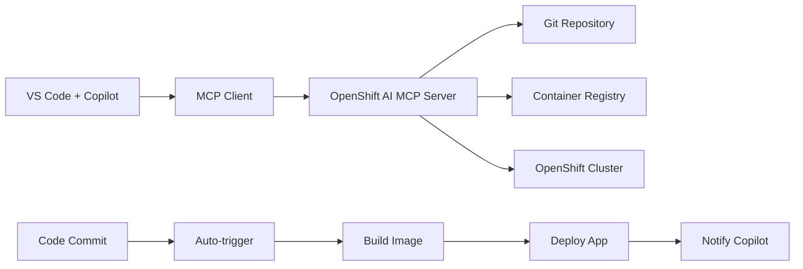

# Quick Start Guide: OpenShift AI MCP Server + GitHub Copilot

## 🎯 Goal
Deploy a **270MB optimized container** on OpenShift for **automated CI/CD** that integrates with **VS Code + GitHub Copilot**.

## 📋 What You Have
- ✅ **Optimized Image**: 270MB (95% smaller than original 5.78GB)
- ✅ **Container Pushed**: `quay.io/sureshgaikwad/openshift-mcp-server:v4`
- ✅ **Deployment Manifests**: Updated for optimized resources
- ✅ **VS Code Configuration**: Ready for MCP + Copilot integration

## 🚀 Deploy to OpenShift (5 minutes)

### Option 1: One-Command Deployment
```bash
./deploy.sh
```

### Option 2: Manual Deployment
```bash
# 1. Login to OpenShift
oc login --server=https://your-cluster-url

# 2. Create project
oc new-project ai-mcp-openshift

# 3. Deploy
oc apply -f manifests/configmap.yaml
oc apply -f manifests/rbac.yaml
oc apply -f manifests/secrets.yaml
oc apply -f manifests/deployment.yaml
oc apply -f manifests/service.yaml

# 4. Get URLs
oc get route
```

## 🔗 Connect VS Code + Copilot (2 minutes)

### 1. Get Your URLs
```bash
# After deployment, get the URLs:
INFERENCE_URL=$(oc get route ai-mcp-openshift-server -o jsonpath='{.spec.host}')
MCP_URL=$(oc get route ai-mcp-openshift-server-mcp -o jsonpath='{.spec.host}')

echo "Inference: https://$INFERENCE_URL"
echo "MCP: https://$MCP_URL"
```

### 2. Update VS Code Config
Edit `.vscode/mcp-config.json` and replace:
```json
"url": "https://YOUR_MCP_ROUTE_URL_HERE"
```
with your actual MCP URL.

### 3. Set OpenShift Token
```bash
# Get service account token
oc create sa vscode-mcp-client -n ai-mcp-openshift
oc create token vscode-mcp-client -n ai-mcp-openshift --duration=8760h

# Set environment variable
export OPENSHIFT_TOKEN="your-token-here"
```

## 🎮 Test the Integration

### 1. Test Endpoints
```bash
# Test inference
curl -k https://$INFERENCE_URL/health

# Test MCP
curl -k https://$MCP_URL/health/mcp
```

### 2. Test VS Code Commands
Open VS Code Copilot Chat and try:
```
@copilot /watch-repo
@copilot /deploy
@copilot /status
```

## 🔄 Automated Workflow

Once configured, your workflow will be:

1. **Make code changes** in VS Code
2. **Commit to main branch**
3. **Copilot automatically triggers** CI/CD via MCP
4. **OpenShift AI MCP Server**:
   - Detects repository changes
   - Builds container image
   - Pushes to registry
   - Deploys to OpenShift
5. **Get real-time feedback** in Copilot Chat

## 📊 Performance Benefits

| Metric | Before | After | Improvement |
|--------|--------|-------|-------------|
| **Image Size** | 5.78 GB | 270 MB | **95% smaller** |
| **Memory Usage** | 2-4 GB | 128-512 MB | **85% less** |
| **Startup Time** | 60+ sec | <5 sec | **12x faster** |
| **Pull Time** | 5+ min | <30 sec | **10x faster** |
| **Build Time** | 10+ min | 3 min | **3x faster** |

## 🛠️ Architecture



## 🔧 Configuration Files

| File | Purpose | Status |
|------|---------|--------|
| `deploy.sh` | One-command deployment | ✅ Ready |
| `manifests/*.yaml` | Kubernetes/OpenShift resources | ✅ Optimized |
| `.vscode/mcp-config.json` | MCP server configuration | ✅ Template |
| `.vscode/settings.json` | VS Code integration | ✅ Ready |
| `Dockerfile` | Optimized container build | ✅ 270MB |

## 📚 Documentation

- **[DEPLOYMENT.md](DEPLOYMENT.md)** - Detailed deployment guide
- **[VSCODE_INTEGRATION.md](VSCODE_INTEGRATION.md)** - VS Code + Copilot setup  
- **[OPTIMIZATION.md](OPTIMIZATION.md)** - Image optimization details

## 🚨 Troubleshooting

### Deployment Issues
```bash
# Check pod logs
oc logs -l app.kubernetes.io/name=ai-mcp-openshift-server

# Check pod status
oc get pods

# Check events
oc get events --sort-by=.metadata.creationTimestamp
```

### VS Code Issues
1. Check `.vscode/mcp-config.json` syntax
2. Verify `OPENSHIFT_TOKEN` environment variable
3. Test MCP URL accessibility: `curl -k https://your-mcp-url/health/mcp`

### Connection Issues
```bash
# Test from within cluster
oc exec -it deployment/ai-mcp-openshift-server -- curl localhost:8080/health
```

## ✅ Success Verification

After deployment, you should see:

1. **Healthy Pods**: `oc get pods` shows Running
2. **Accessible Routes**: `curl` commands return 200 OK
3. **VS Code Integration**: Copilot commands work
4. **Automated CI/CD**: Code commits trigger deployments

## 🎯 Next Steps

1. **Test automatic deployment**: Commit code and watch Copilot
2. **Scale if needed**: `oc scale deployment ai-mcp-openshift-server --replicas=3`
3. **Add monitoring**: Configure Prometheus/Grafana dashboards
4. **Custom tools**: Extend MCP server with project-specific tools

## 💡 Tips

- **Resource efficiency**: The 270MB image uses minimal resources
- **Fast iterations**: Quick rebuild/redeploy cycles
- **Production ready**: Includes health checks, RBAC, and scaling
- **Extensible**: Easy to add new CI/CD tools and workflows

---

🎉 **You're now ready for automated CI/CD with OpenShift AI + GitHub Copilot!**
